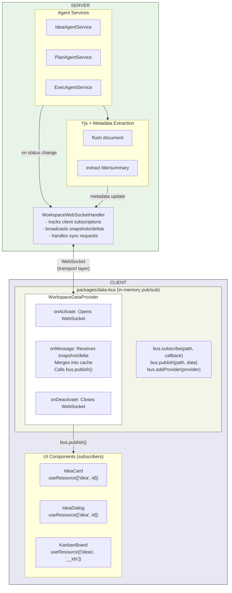

# Resource Event System: Real-time Updates for Background Agent Processing

## Problem Statement

When a user creates a new idea and sends a message, the agent should continue working in the background even if the dialog is closed. The Kanban card should reflect the current state (Running/Idle), and when the agent finishes, the document and metadata (title, summary) should be updated - all without requiring the dialog to be open.

## Open Issues (Resolved)

| Issue | Resolution |
|-------|------------|
| **Providers manage connection; eventbus mediates** | Use existing `data-bus` package from cloudpack - providers have `onActivate`/`onDeactivate` lifecycle hooks and publish to bus |
| **Event bus protocol unclear** | Defined below in "Delta Sync Protocol" section - subscribe/snapshot/delta/collection messages with version tracking |
| **How are JSON objects delta'd?** | Use simple operations (`set`, `merge`, `append`, `splice`) with `keyPath` for nested updates |
| **How are collections delta'd?** | Use ID list at known path (e.g., `['ideas', '__ids']`) with `collection_add`/`collection_remove` messages |
| **Where are ideas stored, how are subs notified?** | Server stores in database; emits through `ResourceEventBus` → `WorkspaceWebSocketHandler` → client provider |
| **Item paths with Zod typing** | `data-bus` already supports this via `createDataPath({ path, type: z.schema() })` |
| **Bus federation for cloud + local** | Future concern - architecture supports it via bridge providers but not needed initially |
| **Authorization/user context** | Implemented at provider level via closures; provider passes user context when connecting WebSocket |

### Current Broken Behavior

1. **User creates idea, sends prompt, closes dialog**
2. **Kanban card shows "Idle"** instead of "Running"
3. **Description shows "Processing..."** - never updates
4. **Reopening dialog later**: Chat shows agent responded, but document wasn't updated
5. **Reopening during processing**: Working indicator doesn't show (state not synced)

### Root Causes Identified

1. **No metadata extraction**: Agent writes to Yjs document, but title/summary never synced to idea record
2. **Yjs edits lost when no client connected**: Agent edits Yjs, but if room is destroyed before flush, edits are lost
3. **Session state not broadcast on reconnect**: Client doesn't know agent is still running
4. **No general subscription architecture**: Components hardcode their own subscription logic

---

## Design Goals

1. **Agent-agnostic**: Works for Idea Agent, Plan Agent, Execution Agent, any future agent
2. **Resource-agnostic**: Works for ideas, documents, things, any resource type
3. **Connection-independent**: Server persists state and syncs to all clients when they connect
4. **Metadata auto-sync**: When agent finishes writing a document, metadata (title, summary, tags) is extracted and saved
5. **Graceful degradation**: Works for non-workspace items (user-scoped), then workspace items
6. **Efficient subscriptions**: Client-side event bus with reference counting - multiple UI subscribers share single network connection
7. **Lazy-loaded providers**: Data sources only activate when something needs data
8. **Delta sync**: Efficiently update already-subscribed data across different subscriber lifespans

---

## Architecture Overview



**Key points:**
- **Data-bus is transport-agnostic** - no networking built in
- **Provider handles WebSocket** - opens connection on activate, closes on deactivate
- **Provider publishes to bus** - when it receives data from server, calls `bus.publish()`
- **Server has no data-bus** - just broadcasts via existing WebSocket handler
- **Reference counting** - multiple components subscribing to same path share one subscription

---

## Yjs vs Data-bus: Different Concerns

**Important:** Data-bus does NOT replace Yjs. They handle different concerns:

| System | Purpose | Data Type | Protocol |
|--------|---------|-----------|----------|
| **Yjs** | Real-time document editing | Text/rich content | y-websocket (CRDT) |
| **Data-bus** | Metadata/state sync | Discrete objects | Snapshot + delta |

### All Documents Continue to Stream via Yjs

When AI (or any user) edits a document, the content streams in real-time via Yjs:

- **Idea documents** (`idea-doc-{ideaId}`)
- **Plan documents** (`impl-plan-{ideaId}`)
- **Design documents** (future)
- **Any collaborative document**

```
AI Agent writes to Y.Doc
        │
        ▼ (y-websocket, CRDT sync)
YjsCollaborationHandler
        │
        ▼ (broadcasts to all clients in room)
Client Y.Doc updates in real-time
        │
        ▼
Editor shows streaming text
```

**This is unchanged.** Yjs handles collaborative editing with automatic conflict resolution (CRDTs).

### Data-bus Only Handles Metadata

Data-bus syncs the discrete state that appears on cards and outside the editor:

```typescript
// What data-bus syncs:
{
  id: 'idea-123',
  title: 'My Idea',           // Extracted from doc after agent finishes
  summary: 'A brief desc...',  // Extracted from doc after agent finishes
  agentStatus: 'running',      // Set by agent service
  tags: ['feature', 'ui'],
  updatedAt: '2024-01-08...'
}
```

### When Metadata Gets Updated

1. **Agent starts** → `agentStatus: 'running'` via data-bus delta
2. **Agent writes** → Document streams via Yjs (not data-bus)
3. **Agent finishes** → Extract title/summary from Yjs doc → data-bus delta with metadata

### Yjs Room Lifecycle (Critical for Background Agents)

**Problem:** If user closes dialog while agent is working, the Yjs room might be destroyed and edits lost.

**Solution:** Keep room alive while agent session is active:

```typescript
// YjsCollaborationHandler
class YjsCollaborationHandler {
  private activeAgentSessions: Set<string> = new Set(); // roomNames with active agents

  // Called by IdeaAgentService when agent starts
  markAgentActive(roomName: string): void {
    this.activeAgentSessions.add(roomName);
  }

  // Called by IdeaAgentService when agent finishes
  markAgentInactive(roomName: string): void {
    this.activeAgentSessions.delete(roomName);
    this.checkRoomCleanup(roomName);
  }

  // Only destroy room if no clients AND no active agent
  private checkRoomCleanup(roomName: string): void {
    const room = this.rooms.get(roomName);
    if (!room) return;

    const hasClients = room.clients.size > 0;
    const hasActiveAgent = this.activeAgentSessions.has(roomName);

    if (!hasClients && !hasActiveAgent) {
      this.flushAndDestroyRoom(roomName);
    }
  }

  // Force persist and extract metadata (called when agent finishes)
  async flushAndExtractMetadata(roomName: string): Promise<ExtractedMetadata | null> {
    const room = this.rooms.get(roomName);
    if (!room) return null;

    // 1. Force persist immediately (bypass debounce)
    await this.persistDoc(room);

    // 2. Extract text content from Y.Text
    const content = room.doc.getText('content').toString();

    // 3. Parse and return metadata
    return extractMetadataFromMarkdown(content);
  }
}
```

**Persistence flow when user closes dialog:**
```
1. User closes dialog
   └─▶ Client disconnects from Yjs room
   └─▶ room.clients.size = 0

2. Agent continues working
   └─▶ activeAgentSessions.has(roomName) = true
   └─▶ Room stays alive, NOT destroyed

3. Agent writes to Y.Doc
   └─▶ Debounced persistence writes to disk

4. Agent finishes
   └─▶ flushAndExtractMetadata() called
   └─▶ Immediate persist to disk
   └─▶ markAgentInactive(roomName)
   └─▶ Room can now be destroyed (no clients, no agent)

5. User reopens dialog later
   └─▶ New Yjs room created
   └─▶ Loads persisted state from disk
   └─▶ User sees completed document
```

---

## Core Components

### 1. Data Bus Package (Client - COPY FROM CLOUDPACK)

Use the existing `@ms-cloudpack/data-bus` package, copied to `packages/data-bus`.

**Source**: `/Users/dzearing/git/cloudpack/packages/data-bus`
**Destination**: `packages/data-bus`

The data-bus already provides:
- **Hierarchical path-based subscriptions**: `['idea', 'abc-123']`
- **Reference counting**: Providers activate on first sub, deactivate on last unsub
- **Lazy-loaded providers**: `onActivate`/`onDeactivate` lifecycle
- **Type-safe paths with Zod**: `createDataPath({ path, type: z.schema() })`
- **Immediate callback**: Subscriber receives cached state immediately
- **Parent notification**: Publishing to `['a','b']` notifies subscribers to `['a']`

**Extensions needed:**
```
packages/data-bus/
├── src/
│   ├── ... (existing files from cloudpack)
│   ├── delta/
│   │   ├── DeltaMerger.ts      # NEW: Apply delta operations
│   │   └── types.ts            # NEW: Delta protocol types
│   ├── react/
│   │   └── useResource.ts      # NEW: React hook
│   └── VersionedState.ts       # NEW: Track versions per path
```

**Core API** (existing):
```typescript
import { createDataBus, createDataPath } from '@ui-kit/data-bus';

const bus = createDataBus();

// Type-safe path with Zod
const ideaPath = createDataPath({
  path: ['idea', ideaId],
  type: IdeaSchema
});

// Subscribe - callback fires immediately with cached state
const dispose = bus.subscribe(ideaPath, (value, oldValue, path) => {
  console.log('Idea updated:', value);
});

// Publish - notifies all subscribers
bus.publish(['idea', ideaId], updatedIdea);

// Provider with lifecycle
bus.addProvider({
  path: ['idea'],
  onActivate: ({ bus }) => {
    // Connect WebSocket, start fetching
  },
  onDeactivate: ({ bus }) => {
    // Cleanup connections
  },
  onPublish: ({ value, oldValue }) => {
    // Transform data before broadcasting
    return value;
  }
});
```

**Reference Counting Behavior** (built-in):
```
IdeaCard subscribes to ['idea', 'abc-123']
  → Provider onActivate() called (first sub to 'idea' type)
  → Provider sends subscribe message to server

IdeaDialog subscribes to ['idea', 'abc-123']
  → NO new activation (already active)
  → Callback receives current cached state immediately

IdeaCard unmounts
  → Still have subscribers, no deactivation

IdeaDialog unmounts
  → Last subscriber gone
  → Provider onDeactivate() called
  → Provider sends unsubscribe message to server
```

**Type-Safe Path Helpers:**
```typescript
// apps/ideate/client/src/paths/resourcePaths.ts
import { createDataPath } from '@ui-kit/data-bus';
import { z } from 'zod';
import { IdeaSchema, ThingSchema } from '../types';

// Type-safe path creators
export const ideaPath = (id: string) => createDataPath({
  path: ['idea', id],
  type: IdeaSchema
});

export const ideasListPath = (workspaceId: string) => createDataPath({
  path: ['workspace', workspaceId, 'ideas', '__ids'],
  type: z.array(z.string())
});

export const thingPath = (id: string) => createDataPath({
  path: ['thing', id],
  type: ThingSchema
});

// Usage in components - fully typed
const { data: idea } = useResource(ideaPath('abc-123'));
// idea is typed as Idea | null
```

**useResource Hook Implementation:**
```typescript
// packages/data-bus/src/react/useResource.ts
import { useState, useEffect, useRef } from 'react';
import type { DataBus, DataBusPath } from '../types';

interface UseResourceResult<T> {
  data: T | null;
  isLoading: boolean;
  version: number | null;
}

export function useResource<T>(
  bus: DataBus,
  path: DataBusPath<T> | string[] | null
): UseResourceResult<T> {
  const [data, setData] = useState<T | null>(null);
  const [isLoading, setIsLoading] = useState(true);
  const [version, setVersion] = useState<number | null>(null);

  // Stable path reference for dependency comparison
  const pathKey = path ? JSON.stringify(path) : null;

  useEffect(() => {
    if (!path) {
      setData(null);
      setIsLoading(false);
      return;
    }

    setIsLoading(true);

    const dispose = bus.subscribe(path, (value, oldValue, eventPath, meta) => {
      setData(value as T);
      setVersion(meta?.version ?? null);
      setIsLoading(false);
    });

    return dispose;
  }, [bus, pathKey]);

  return { data, isLoading, version };
}

// Convenience hook with singleton bus
import { dataBus } from '../providers/dataBus';

export function useIdeaResource(ideaId: string | null) {
  return useResource(dataBus, ideaId ? ideaPath(ideaId) : null);
}
```

### 2. Delta Sync Protocol (NEW)

Wire protocol for efficient incremental updates between server and client.

**Client → Server:**
```typescript
interface SubscribeMessage {
  type: 'subscribe';
  path: string[];              // e.g., ['idea', 'abc-123']
  lastKnownVersion?: number;   // For reconnection sync
}

interface UnsubscribeMessage {
  type: 'unsubscribe';
  path: string[];
}

interface SyncRequestMessage {
  type: 'sync_request';
  subscriptions: Array<{
    path: string[];
    lastKnownVersion: number;
  }>;
}
```

**Server → Client:**
```typescript
interface SnapshotMessage {
  type: 'snapshot';
  path: string[];
  version: number;
  data: unknown;
}

interface DeltaMessage {
  type: 'delta';
  path: string[];
  fromVersion: number;
  toVersion: number;
  operations: DeltaOperation[];
}

interface DeltaOperation {
  op: 'set' | 'delete' | 'merge' | 'append' | 'splice';
  keyPath: (string | number)[];  // Path within object
  value?: unknown;
  // For splice:
  start?: number;
  deleteCount?: number;
  items?: unknown[];
}

// Collections use ID list at known path
// Path: ['workspace', 'ws-123', 'ideas', '__ids']
// Value: ['idea-1', 'idea-2', 'idea-3']

interface CollectionAddMessage {
  type: 'collection_add';
  collectionPath: string[];
  itemId: string;
  position: number;
  version: number;
  metadata?: { title?: string; updatedAt?: string };
}

interface CollectionRemoveMessage {
  type: 'collection_remove';
  collectionPath: string[];
  itemId: string;
  version: number;
}

interface SyncResponseMessage {
  type: 'sync_response';
  updates: Array<{
    path: string[];
    snapshotRequired: boolean;  // If true, client was too far behind
    currentVersion: number;
    snapshot?: unknown;
    deltas?: DeltaMessage[];
  }>;
}
```

**Delta Examples:**
```typescript
// Update idea title
{ type: 'delta', path: ['idea', 'abc'], fromVersion: 42, toVersion: 43,
  operations: [{ op: 'set', keyPath: ['title'], value: 'New Title' }] }

// Add tag to array
{ type: 'delta', path: ['idea', 'abc'], fromVersion: 43, toVersion: 44,
  operations: [{ op: 'append', keyPath: ['tags'], value: 'feature' }] }

// Update nested plan phase
{ type: 'delta', path: ['idea', 'abc'], fromVersion: 44, toVersion: 45,
  operations: [{ op: 'set', keyPath: ['plan', 'phases', 0, 'status'], value: 'complete' }] }
```

### 3. Server-Side Broadcasting (Extend Existing)

The server doesn't need a data-bus - it extends the existing `WorkspaceWebSocketHandler` with delta support.

**File**: `apps/ideate/server/src/websocket/WorkspaceWebSocketHandler.ts` (MODIFY)

```typescript
// Existing handler gains these capabilities:

class WorkspaceWebSocketHandler {
  // Track versions per resource for delta generation
  private resourceVersions: Map<string, number> = new Map();

  // Retain recent deltas for reconnection sync
  private deltaHistory: Map<string, DeltaMessage[]> = new Map();

  // Send full snapshot on initial subscription
  sendSnapshot(clientId: string, path: string[], data: unknown, version: number): void;

  // Send delta update to subscribed clients
  broadcastDelta(path: string[], delta: DeltaMessage): void;

  // Handle reconnection - send missed deltas or full snapshot
  handleSyncRequest(clientId: string, subscriptions: SyncSubscription[]): void;
}
```

**How agent services use it:**
```typescript
// In IdeaAgentService - when status changes:
this.wsHandler.broadcastDelta(['idea', ideaId], {
  type: 'delta',
  path: ['idea', ideaId],
  fromVersion: 42,
  toVersion: 43,
  operations: [{ op: 'set', keyPath: ['agentStatus'], value: 'running' }]
});
```

### 4. Document Metadata Extractor (Server)

When a Yjs document edit completes, extract structured metadata:

**File**: `apps/ideate/server/src/services/DocumentMetadataExtractor.ts` (NEW)

```typescript
interface ExtractedMetadata {
  title: string;
  summary: string;
  tags: string[];
}

function extractMetadataFromMarkdown(content: string): ExtractedMetadata {
  // Parse markdown to extract:
  // - Title from first # heading
  // - Summary from ## Summary section or first paragraph
  // - Tags from Tags: line
}
```

### 5. Enhanced Agent Service Pattern

All agents (Idea, Plan, Execution) follow same pattern:

```typescript
class AgentService {
  constructor(private eventBus: ResourceEventBus) {}

  async processMessage(...) {
    // 1. Emit status change: 'running'
    this.eventBus.emit({
      type: 'status_change',
      resourceType: 'idea',
      resourceId: ideaId,
      data: { agentStatus: 'running' }
    });

    // 2. Process message, write to Yjs
    await this.doWork(...);

    // 3. Extract metadata from completed document
    const metadata = extractMetadataFromMarkdown(documentContent);

    // 4. Emit metadata update (persists to DB + broadcasts)
    this.eventBus.emit({
      type: 'metadata_update',
      resourceType: 'idea',
      resourceId: ideaId,
      data: { title: metadata.title, summary: metadata.summary }
    });

    // 5. Emit status change: 'idle'
    this.eventBus.emit({
      type: 'status_change',
      resourceType: 'idea',
      resourceId: ideaId,
      data: { agentStatus: 'idle' }
    });
  }
}
```

### 6. Yjs Persistence Enhancement

Force flush document and extract metadata when agent completes:

**File**: `apps/ideate/server/src/websocket/YjsCollaborationHandler.ts` (MODIFY)

```typescript
// New method: Force flush and extract metadata
async flushAndExtractMetadata(roomName: string): Promise<ExtractedMetadata | null> {
  const room = this.rooms.get(roomName);
  if (!room) return null;

  // 1. Force persist immediately (bypass debounce)
  await this.persistDoc(room);

  // 2. Extract text content from Y.Text
  const content = room.text.toString();

  // 3. Parse and return metadata
  return extractMetadataFromMarkdown(content);
}
```

---

## Event Flow: New Idea Creation

```
1. User opens IdeaDialog for new idea
   └─▶ Client: useIdeaAgent connects with sessionId (unique per session)
   └─▶ Client: Yjs room: idea-doc-new-{sessionId} (isolated)
   └─▶ Client: NO data-bus subscription yet (idea doesn't exist)

2. User sends first message
   └─▶ Client: IdeaDialog creates idea (POST /api/ideas)
   └─▶ Server: Returns ideaId: 'abc-123'
   └─▶ Client: NOW subscribes via useResource(['idea', 'abc-123'])
   └─▶ Client: useIdeaAgent transfers session to real ideaId

3. Server: IdeaAgentService.processMessage()
   └─▶ Calls wsHandler.broadcastDelta(['idea', 'abc-123'], { agentStatus: 'running' })
   └─▶ WorkspaceWebSocketHandler sends delta to subscribed clients
   └─▶ Client IdeaCard receives delta, shows "Running"

4. User closes dialog
   └─▶ Client: IdeaDialog unmounts
   └─▶ Client: useIdeaAgent disconnects from agent WS
   └─▶ Client: IdeaCard still subscribed via useResource(['idea', 'abc-123'])
   └─▶ Server: Agent continues processing in background

5. Server: Agent finishes document
   └─▶ IdeaAgentService calls yjsHandler.flushAndExtractMetadata()
   └─▶ Returns: { title: 'Recipe Sharing', summary: 'A feature for...', tags: [...] }
   └─▶ IdeaService.update(ideaId, { title, summary, tags })
   └─▶ wsHandler.broadcastDelta(['idea', ideaId], { title, summary, tags, agentStatus: 'idle' })

6. Client: IdeaCard receives delta
   └─▶ Provider merges delta into cached state
   └─▶ Calls bus.publish() → IdeaCard's callback fires
   └─▶ Card re-renders with new title, summary, "Idle" status

7. User reopens dialog
   └─▶ IdeaDialog subscribes via useResource(['idea', 'abc-123'])
   └─▶ Immediately receives cached state from provider
   └─▶ useIdeaAgent reconnects, replays queued messages
   └─▶ Shows complete chat history and updated document
```

---

## Implementation Plan

### Phase 1: Copy and Extend Data-Bus

**1.1 Copy data-bus package**
```bash
# Copy from cloudpack to claude-flow monorepo
cp -r /Users/dzearing/git/cloudpack/packages/data-bus packages/data-bus
# Update package name to @ui-kit/data-bus
```

**1.2 Add delta merger utility**
- File: `packages/data-bus/src/delta/DeltaMerger.ts`
- Apply delta operations to state immutably
- Handle nested objects and arrays
- Track versions per path

**1.3 Add React hook**
- File: `packages/data-bus/src/react/useResource.ts`
- Hook that wraps bus.subscribe
- Returns `{ data, isLoading, version }`
- Handles subscribe/unsubscribe on mount/unmount

**1.4 Add versioned state tracking**
- File: `packages/data-bus/src/VersionedState.ts`
- Track version per path
- Detect gaps for reconnection sync

### Phase 2: Server Infrastructure

**2.1 Create ResourceEventBus (Server)**
- File: `apps/ideate/server/src/services/ResourceEventBus.ts`
- Generate deltas from object changes (diff old vs new)
- Track versions per resource
- Retain deltas for reconnection window (5 min / 100 deltas max)

**2.2 Extend WorkspaceWebSocketHandler**
- File: `apps/ideate/server/src/websocket/WorkspaceWebSocketHandler.ts`
- Handle subscribe/unsubscribe messages
- Send snapshots on initial subscribe
- Send deltas on subsequent updates
- Handle sync_request for reconnection

**2.3 Create DocumentMetadataExtractor**
- File: `apps/ideate/server/src/services/DocumentMetadataExtractor.ts`
- Parses markdown content to extract title, summary, tags

**2.4 Enhance YjsCollaborationHandler**
- File: `apps/ideate/server/src/websocket/YjsCollaborationHandler.ts`
- Add `flushAndExtractMetadata(roomName)` method
- Force persist + extract on agent completion

**2.5 Update IdeaAgentService**
- File: `apps/ideate/server/src/services/IdeaAgentService.ts`
- Emit deltas through ResourceEventBus on status changes
- Extract metadata and emit delta when document extraction completes

### Phase 3: Client Integration

**3.1 Create WorkspaceDataProvider**
- File: `apps/ideate/client/src/providers/WorkspaceDataProvider.ts`
- Implements `DataBusProvider` interface
- Manages single WebSocket connection
- Routes messages to data-bus
- Applies deltas via DeltaMerger

**3.2 Set up data-bus singleton**
- File: `apps/ideate/client/src/providers/dataBus.ts`
- Create singleton data-bus instance
- Register WorkspaceDataProvider

**3.3 Update IdeaCard to use data-bus**
- File: `apps/ideate/client/src/components/IdeaCard/IdeaCard.tsx`
- Use `useResource(['idea', ideaId])`
- Remove prop-based state management
- Auto-updates when deltas arrive

**3.4 Update IdeaDialog to use data-bus**
- File: `apps/ideate/client/src/components/IdeaDialog/IdeaDialog.tsx`
- Use `useResource` for metadata sync
- Keep existing agent hooks for chat/document editing
- Show agent status on reconnect

### Phase 4: Cleanup and Testing

**4.1 Remove redundant subscription logic**
- ThingIdeas: Remove hardcoded `handleResourceUpdated`
- useWorkspaceSocket: Simplify (provider handles subscriptions)

**4.2 End-to-end testing**
- Test all success criteria scenarios
- Verify reference counting works correctly
- Test reconnection sync with version gaps

---

## Files to Create/Modify

### Package: packages/data-bus (copy + extend)

**Copy from cloudpack:**
1. `packages/data-bus/` - Copy entire package from `/Users/dzearing/git/cloudpack/packages/data-bus`

**New extensions:**
2. `packages/data-bus/src/delta/DeltaMerger.ts` - Apply delta operations
3. `packages/data-bus/src/delta/types.ts` - Delta protocol types
4. `packages/data-bus/src/react/useResource.ts` - React hook
5. `packages/data-bus/src/VersionedState.ts` - Version tracking per path

### New Files (Server)
6. `apps/ideate/server/src/services/ResourceEventBus.ts` - Server-side delta generation + broadcasting
7. `apps/ideate/server/src/services/DocumentMetadataExtractor.ts` - Parse markdown for title/summary

### New Files (Client)
8. `apps/ideate/client/src/providers/WorkspaceDataProvider.ts` - WebSocket provider for data-bus
9. `apps/ideate/client/src/providers/dataBus.ts` - Singleton data-bus instance
10. `apps/ideate/client/src/paths/resourcePaths.ts` - Type-safe path helpers (ideaPath, thingPath, etc.)

### Modified Files (Server)
10. `apps/ideate/server/src/websocket/WorkspaceWebSocketHandler.ts` - Add delta protocol support
11. `apps/ideate/server/src/websocket/YjsCollaborationHandler.ts` - Add flushAndExtractMetadata
12. `apps/ideate/server/src/services/IdeaAgentService.ts` - Emit through ResourceEventBus
13. `apps/ideate/server/src/index.ts` - Wire up ResourceEventBus

### Modified Files (Client)
14. `apps/ideate/client/src/components/IdeaCard/IdeaCard.tsx` - Use useResource hook
15. `apps/ideate/client/src/components/IdeaDialog/IdeaDialog.tsx` - Use useResource hook
16. `apps/ideate/client/src/components/Things/ThingIdeas.tsx` - Simplify, use data-bus

---

## Design Decisions

1. **Use existing data-bus**: Copy `@ms-cloudpack/data-bus` to `packages/data-bus` rather than creating new package
2. **Summary text while working**: Empty/blank until agent completes and extracts summary from document
3. **Subscription level**: Per-component subscription - each uses `useResource(['idea', ideaId])`
4. **Collection subscriptions**: Use ID list at known path (e.g., `['ideas', '__ids']`) rather than dynamic child subscription
5. **Delta sync is phase 1**: Efficient partial updates from the start, not an optimization for later
6. **Bus federation is future**: Architecture supports it via bridge providers but not needed initially
7. **Reference counting**: Built into data-bus - providers activate on first sub, deactivate on last unsub
8. **Provider pattern**: Lazy-loaded providers (data-bus built-in) only activate when something subscribes
9. **Conflict resolution**: Server wins (last-write-wins with server authority) - simpler than CRDTs
10. **Version tracking**: Each resource has monotonic version number for ordering and reconnection sync

---

## Success Criteria

1. **Create idea, send prompt, close dialog immediately**
   - Kanban card shows "Running"
   - Card summary is empty/blank (not "Processing...")

2. **Wait for agent to complete (dialog closed)**
   - Kanban card updates to show actual title from document
   - Kanban card updates to show actual summary from document
   - Kanban card shows "Idle"

3. **Reopen dialog after completion**
   - Chat history shows full conversation
   - Document shows generated content
   - No "working" indicator (agent is idle)

4. **Reopen dialog while still processing**
   - Working indicator shows above chat input
   - Can see streaming response continuing
   - Document updates in real-time

5. **Works without workspace**
   - All above scenarios work for ideas not in a workspace
   - Updates are user-scoped (only owner sees them)

---

## Server Logging (Critical for Debugging)

Add structured logging to `WorkspaceWebSocketHandler` for debugging real-time updates:

```typescript
// Log levels: debug for high-volume, info for key events, warn/error for problems

// 1. Connection lifecycle
logger.info('ws:connect', { clientId, userId, workspaceId });
logger.info('ws:disconnect', { clientId, reason, activeSubscriptions: count });

// 2. Subscription management
logger.debug('ws:subscribe', { clientId, path, version: lastKnownVersion });
logger.debug('ws:unsubscribe', { clientId, path });
logger.debug('ws:subscriptions', { path, subscriberCount });

// 3. Delta broadcasting
logger.debug('ws:broadcast:delta', {
  path,
  fromVersion,
  toVersion,
  operations: ops.length,
  recipientCount
});
logger.debug('ws:broadcast:snapshot', { path, version, recipientCount });

// 4. Reconnection sync
logger.info('ws:sync:request', {
  clientId,
  subscriptionCount,
  oldestVersion: minVersion
});
logger.info('ws:sync:response', {
  clientId,
  snapshotsRequired: count,
  deltasReplayed: count
});

// 5. Version tracking
logger.debug('ws:version:bump', { path, oldVersion, newVersion });
logger.warn('ws:version:gap', { clientId, path, expected, received });

// 6. Agent integration points
logger.info('agent:status', { ideaId, status: 'running' | 'idle', userId });
logger.info('agent:metadata', { ideaId, title, hassSummary: !!summary });

// 7. Errors
logger.error('ws:broadcast:failed', { path, error, clientId });
logger.error('ws:delta:invalid', { path, operations, reason });
```

**Key debugging scenarios:**

| Problem | Logs to check |
|---------|---------------|
| Card not updating | `ws:subscribe` (did it subscribe?), `ws:broadcast:delta` (was delta sent?) |
| Wrong data after reconnect | `ws:sync:request/response`, `ws:version:gap` |
| Multiple cards showing same update | Check `path` in subscribe logs - ensure unique IDs |
| Delta not arriving | `ws:broadcast:delta` recipientCount, `ws:subscriptions` for path |
| Agent status stuck | `agent:status` logs, check if broadcast was called |

---

## Additional Notes

- The `@ms-cloudpack/data-bus` package already has comprehensive tests and documentation
- See `packages/data-bus/README.md` after copying for full API documentation
- The delta protocol defined here extends the base data-bus capabilities
