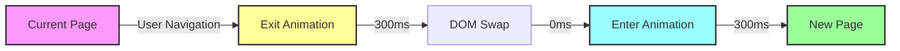
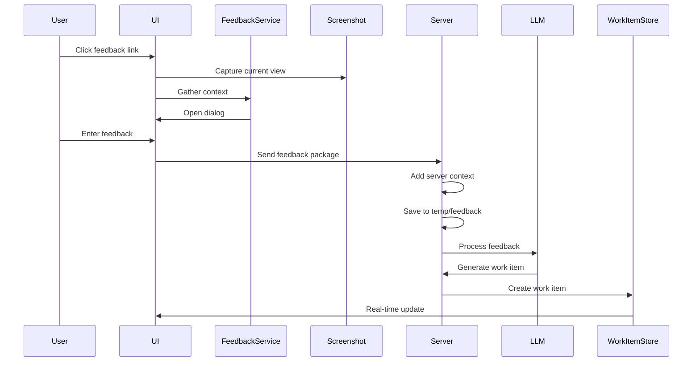

# Claude Flow Client Architecture

## Executive Summary

This document defines the client-side architecture for Claude Flow, focusing on shared state management, real-time subscriptions, performance optimization through lazy loading, navigation patterns, and extensible page scaffolding.

## Table of Contents

1. [Architecture Overview](#architecture-overview)
2. [State Management](#state-management)
3. [Real-time Subscriptions](#real-time-subscriptions)
4. [Performance & Lazy Loading](#performance--lazy-loading)
5. [Navigation & Routing](#navigation--routing)
6. [Page Transitions](#page-transitions)
7. [Page Scaffolding](#page-scaffolding)
8. [Page Structure Diagrams](#page-structure-diagrams)

## Architecture Overview

### Core Principles

1. **Single Source of Truth**: All shared state in centralized stores
2. **Real-time First**: Live updates as default behavior
3. **Performance**: Sub-second initial load, lazy everything
4. **Predictable Navigation**: Clear backstack and transitions
5. **Extensible**: Easy to add new pages and features

### High-Level Architecture

```
┌─────────────────────────────────────────────────────────────────┐
│                         Application Shell                         │
│  ┌─────────────────────────────────────────────────────────┐   │
│  │                      Route Provider                       │   │
│  │  ┌─────────────────────────────────────────────────┐    │   │
│  │  │                  Page Container                   │    │   │
│  │  │  ┌────────────┐  ┌────────────┐  ┌──────────┐  │    │   │
│  │  │  │   Header   │  │    Page    │  │ Sidebar  │  │    │   │
│  │  │  └────────────┘  │  Content   │  └──────────┘  │    │   │
│  │  │                  └────────────┘                 │    │   │
│  │  └─────────────────────────────────────────────────┘    │   │
│  └─────────────────────────────────────────────────────────┘   │
│                                                                  │
│  ┌─────────────────────────────────────────────────────────┐   │
│  │                    Service Layer                         │   │
│  │  ┌──────────┐  ┌──────────┐  ┌──────────┐  ┌────────┐ │   │
│  │  │ DataBus  │  │WebSocket │  │  Auth    │  │  API   │ │   │
│  │  └──────────┘  └──────────┘  └──────────┘  └────────┘ │   │
│  └─────────────────────────────────────────────────────────┘   │
└─────────────────────────────────────────────────────────────────┘
```

## State Management

### Store Architecture

```typescript
// index.ts
export interface StoreArchitecture {
  // Global stores (singleton)
  auth: AuthStore;
  workspace: WorkspaceStore;
  theme: ThemeStore;
  navigation: NavigationStore;

  // Domain stores (lazy loaded)
  projects: ProjectStore;
  workItems: WorkItemStore;
  claude: ClaudeStore;

  // UI stores (ephemeral)
  toast: ToastStore;
  modal: ModalStore;
}
```

### Zustand Store Pattern

```typescript
// authStore.ts
import { create } from 'zustand';
import { subscribeWithSelector } from 'zustand/middleware';
import { dataBus } from '@/services/dataBus';

interface AuthState {
  user: User | null;
  isAuthenticated: boolean;
  isLoading: boolean;

  // Actions
  login: (credentials: LoginCredentials) => Promise<void>;
  logout: () => Promise<void>;
  checkAuth: () => Promise<void>;
}

export const useAuthStore = create<AuthState>()(
  subscribeWithSelector((set, get) => ({
    user: null,
    isAuthenticated: false,
    isLoading: true,

    login: async (credentials) => {
      set({ isLoading: true });
      try {
        const user = await authService.login(credentials);
        set({ user, isAuthenticated: true });
      } finally {
        set({ isLoading: false });
      }
    },

    logout: async () => {
      await authService.logout();
      set({ user: null, isAuthenticated: false });
      // Clear all other stores
      useProjectStore.getState().reset();
      useWorkItemStore.getState().reset();
    },

    checkAuth: async () => {
      const user = await authService.getCurrentUser();
      set({ user, isAuthenticated: !!user, isLoading: false });
    },
  }))
);

// Subscribe to auth changes
useAuthStore.subscribe(
  (state) => state.user,
  (user) => {
    if (user) {
      dataBus.connect(user.id);
    } else {
      dataBus.disconnect();
    }
  }
);
```

### Shared State Principles

1. **Normalized Data**: Store entities by ID
2. **Computed Values**: Use selectors for derived state
3. **Optimistic Updates**: Update UI before server confirms
4. **Rollback on Error**: Revert optimistic updates if failed

```typescript
// projectStore.ts
interface ProjectState {
  // Normalized data
  projects: Record<string, Project>;
  projectIds: string[];

  // UI state
  selectedProjectId: string | null;
  isCreating: boolean;

  // Computed selectors
  selectedProject: () => Project | null;
  sortedProjects: () => Project[];

  // Actions with optimistic updates
  createProject: (data: CreateProjectData) => Promise<void>;
  updateProject: (id: string, data: UpdateProjectData) => Promise<void>;
  deleteProject: (id: string) => Promise<void>;
}

// Implementation with optimistic updates
createProject: async (data) => {
  const tempId = `temp-${Date.now()}`;
  const optimisticProject = { ...data, id: tempId, status: 'creating' };

  // Optimistic update
  set((state) => ({
    projects: { ...state.projects, [tempId]: optimisticProject },
    projectIds: [...state.projectIds, tempId],
  }));

  try {
    const project = await api.createProject(data);

    // Replace temp with real
    set((state) => {
      const { [tempId]: _, ...projects } = state.projects;
      const projectIds = state.projectIds.filter((id) => id !== tempId);

      return {
        projects: { ...projects, [project.id]: project },
        projectIds: [...projectIds, project.id],
      };
    });
  } catch (error) {
    // Rollback
    set((state) => ({
      projects: omit(state.projects, tempId),
      projectIds: state.projectIds.filter((id) => id !== tempId),
    }));
    throw error;
  }
};
```

## Real-time Subscriptions

### DataBus Integration

```typescript
// storeSync.ts
export class StoreSync {
  constructor(
    private dataBus: DataBus,
    private stores: Map<string, StoreApi<any>>
  ) {}

  // Sync store with DataBus
  syncStore<T>(storeName: string, dataKey: string, selector: (data: T) => void) {
    // Subscribe to data changes
    return this.dataBus.subscribe<T>(dataKey, (data) => {
      const store = this.stores.get(storeName);
      if (store) {
        selector(data);
      }
    });
  }

  // Example: Sync projects
  initialize() {
    // Projects list
    this.syncStore('projects', 'projects:list', (projects: Project[]) => {
      useProjectStore.setState({
        projects: keyBy(projects, 'id'),
        projectIds: projects.map((p) => p.id),
      });
    });

    // Individual project updates
    this.syncStore('projects', 'project:*', (event: ProjectEvent) => {
      const { action, project } = event;

      switch (action) {
        case 'created':
        case 'updated':
          useProjectStore.setState((state) => ({
            projects: { ...state.projects, [project.id]: project },
          }));
          break;

        case 'deleted':
          useProjectStore.setState((state) => ({
            projects: omit(state.projects, project.id),
            projectIds: state.projectIds.filter((id) => id !== project.id),
          }));
          break;
      }
    });
  }
}
```

### Subscription Lifecycle

```typescript
// useSubscription.ts
export function useSubscription<T>(key: string, options?: SubscriptionOptions) {
  const [data, setData] = useState<T | undefined>();
  const [error, setError] = useState<Error | null>(null);
  const [isLoading, setIsLoading] = useState(true);

  useEffect(() => {
    let unsubscribe: (() => void) | null = null;

    const subscribe = async () => {
      try {
        // Initial fetch
        const initialData = await dataBus.request<T>(key);
        setData(initialData);
        setIsLoading(false);

        // Subscribe to updates
        unsubscribe = dataBus.subscribe<T>(key, (newData) => {
          setData(newData);
        });
      } catch (err) {
        setError(err as Error);
        setIsLoading(false);
      }
    };

    subscribe();

    return () => {
      unsubscribe?.();
    };
  }, [key]);

  return { data, error, isLoading };
}
```

## Performance & Lazy Loading

### Route-based Code Splitting

```typescript
// appRoutes.tsx
import { lazy, Suspense } from 'react';
import { Routes, Route } from 'react-router-dom';
import { PageLoader } from '@/components/PageLoader';

// Lazy load all pages
const Dashboard = lazy(() => import('@/pages/Dashboard'));
const Projects = lazy(() => import('@/pages/Projects'));
const ProjectDetail = lazy(() => import('@/pages/ProjectDetail'));
const WorkItems = lazy(() => import('@/pages/WorkItems'));
const ClaudeChat = lazy(() => import('@/pages/ClaudeChat'));
const Settings = lazy(() => import('@/pages/Settings'));

// Route configuration
export const routes = [
  {
    path: '/',
    element: Dashboard,
    preload: true, // Preload critical routes
  },
  {
    path: '/projects',
    element: Projects,
    preload: true,
  },
  {
    path: '/projects/:id',
    element: ProjectDetail,
  },
  {
    path: '/work-items',
    element: WorkItems,
  },
  {
    path: '/claude/:sessionId?',
    element: ClaudeChat,
  },
  {
    path: '/settings',
    element: Settings,
  },
];

export function AppRoutes() {
  return (
    <Suspense fallback={<PageLoader />}>
      <Routes>
        {routes.map(({ path, element: Element }) => (
          <Route key={path} path={path} element={<Element />} />
        ))}
      </Routes>
    </Suspense>
  );
}
```

### Progressive Enhancement

```typescript
// progressiveLoader.ts
export class ProgressiveLoader {
  private loadQueue: Array<() => Promise<any>> = [];
  private isIdle = false;

  constructor() {
    // Use requestIdleCallback for non-critical loads
    if ('requestIdleCallback' in window) {
      requestIdleCallback(() => {
        this.isIdle = true;
        this.processQueue();
      });
    } else {
      setTimeout(() => {
        this.isIdle = true;
        this.processQueue();
      }, 2000);
    }
  }

  // Queue non-critical imports
  queue(loader: () => Promise<any>) {
    this.loadQueue.push(loader);
    if (this.isIdle) {
      this.processQueue();
    }
  }

  private async processQueue() {
    while (this.loadQueue.length > 0) {
      const loader = this.loadQueue.shift()!;
      await loader();
    }
  }
}

// Usage
const loader = new ProgressiveLoader();

// Load design system components after initial render
loader.queue(() => import('@claude-flow/design-system'));

// Preload next likely routes
loader.queue(() => import('@/pages/Projects'));
```

### Bundle Optimization

```typescript
// vite.config.ts
export default defineConfig({
  build: {
    rollupOptions: {
      output: {
        manualChunks: {
          // Vendor chunks
          'react-vendor': ['react', 'react-dom', 'react-router-dom'],
          'state-vendor': ['zustand', '@tanstack/react-query'],
          'ui-vendor': ['@claude-flow/design-system'],

          // Feature chunks
          'claude-features': ['./src/pages/ClaudeChat', './src/components/claude'],
          'project-features': ['./src/pages/Projects', './src/pages/ProjectDetail'],
        },
      },
    },
  },
});
```

## Navigation & Routing

### Navigation Store

```typescript
// navigationStore.ts
interface NavigationState {
  // History stack
  history: NavigationEntry[];
  currentIndex: number;

  // Navigation state
  isNavigating: boolean;
  direction: 'forward' | 'backward' | null;

  // Breadcrumb data
  breadcrumbs: BreadcrumbItem[];

  // Actions
  navigate: (to: string, options?: NavigateOptions) => void;
  goBack: () => void;
  goForward: () => void;
  canGoBack: () => boolean;
  canGoForward: () => boolean;
}

interface NavigationEntry {
  path: string;
  title: string;
  state?: any;
  timestamp: number;
}

// Implementation with transition support
export const useNavigationStore = create<NavigationState>((set, get) => ({
  history: [],
  currentIndex: -1,
  isNavigating: false,
  direction: null,
  breadcrumbs: [],

  navigate: (to, options = {}) => {
    const { replace = false, state = {} } = options;
    const entry: NavigationEntry = {
      path: to,
      title: document.title,
      state,
      timestamp: Date.now(),
    };

    set((prev) => {
      if (replace) {
        const history = [...prev.history];
        history[prev.currentIndex] = entry;
        return { history };
      }

      // Remove forward history
      const history = prev.history.slice(0, prev.currentIndex + 1);
      history.push(entry);

      return {
        history,
        currentIndex: history.length - 1,
        direction: 'forward',
        isNavigating: true,
      };
    });

    // Perform navigation
    router.navigate(to, { state });
  },

  goBack: () => {
    const { currentIndex, history } = get();
    if (currentIndex > 0) {
      set({
        currentIndex: currentIndex - 1,
        direction: 'backward',
        isNavigating: true,
      });

      const entry = history[currentIndex - 1];
      router.navigate(entry.path, { state: entry.state });
    }
  },

  canGoBack: () => get().currentIndex > 0,
  canGoForward: () => {
    const { currentIndex, history } = get();
    return currentIndex < history.length - 1;
  },
}));
```

### Route Guards

```typescript
// RouteGuard.tsx
interface RouteGuardProps {
  condition: () => boolean | Promise<boolean>;
  fallback: string;
  children: React.ReactNode;
}

export function RouteGuard({ condition, fallback, children }: RouteGuardProps) {
  const navigate = useNavigate();
  const [isAllowed, setIsAllowed] = useState<boolean | null>(null);

  useEffect(() => {
    const check = async () => {
      const allowed = await condition();
      if (!allowed) {
        navigate(fallback, { replace: true });
      } else {
        setIsAllowed(true);
      }
    };

    check();
  }, [condition, fallback, navigate]);

  if (isAllowed === null) {
    return <PageLoader />;
  }

  return <>{children}</>;
}

// Usage
<RouteGuard
  condition={() => useAuthStore.getState().isAuthenticated}
  fallback="/login"
>
  <ProjectDetail />
</RouteGuard>
```

## Page Transitions

### Transition System

```typescript
// PageTransition.tsx
interface PageTransitionProps {
  children: React.ReactNode;
  transitionKey: string;
}

export function PageTransition({ children, transitionKey }: PageTransitionProps) {
  const { direction } = useNavigationStore();
  const [displayChildren, setDisplayChildren] = useState(children);
  const [transitionStage, setTransitionStage] = useState<'enter' | 'exit'>('enter');

  useEffect(() => {
    if (children !== displayChildren) {
      setTransitionStage('exit');
    }
  }, [children, displayChildren]);

  const handleTransitionEnd = () => {
    if (transitionStage === 'exit') {
      setDisplayChildren(children);
      setTransitionStage('enter');
    }
  };

  const className = cn(
    styles.page,
    styles[direction || 'forward'],
    styles[transitionStage]
  );

  return (
    <div
      className={className}
      onTransitionEnd={handleTransitionEnd}
      key={transitionKey}
    >
      {displayChildren}
    </div>
  );
}
```

### Transition Styles

```css
/* PageTransition.module.css */
@layer base, transitions;

@layer base {
  .page {
    position: absolute;
    inset: 0;
    will-change: transform, opacity;
  }
}

@layer transitions {
  /* Forward navigation */
  .forward.enter {
    animation: slide-in-right var(--duration-300) var(--ease-out);
  }

  .forward.exit {
    animation: slide-out-left var(--duration-300) var(--ease-in);
  }

  /* Backward navigation */
  .backward.enter {
    animation: slide-in-left var(--duration-300) var(--ease-out);
  }

  .backward.exit {
    animation: slide-out-right var(--duration-300) var(--ease-in);
  }

  /* Animations */
  @keyframes slide-in-right {
    from {
      transform: translateX(100%);
      opacity: 0;
    }
    to {
      transform: translateX(0);
      opacity: 1;
    }
  }

  @keyframes slide-out-left {
    from {
      transform: translateX(0);
      opacity: 1;
    }
    to {
      transform: translateX(-20%);
      opacity: 0;
    }
  }

  /* Reduced motion */
  @media (prefers-reduced-motion: reduce) {
    .page {
      animation: none !important;
      transition: opacity var(--duration-200);
    }
  }
}
```

### Transition Flow Diagram



## Page Scaffolding

### Base Page Component

```typescript
// Page.tsx
interface PageProps {
  title: string;
  description?: string;
  actions?: React.ReactNode;
  breadcrumb?: BreadcrumbItem[];
  className?: string;
  children: React.ReactNode;
}

export function Page({
  title,
  description,
  actions,
  breadcrumb,
  className,
  children
}: PageProps) {
  // Set document title
  useDocumentTitle(title);

  // Update navigation store
  useEffect(() => {
    useNavigationStore.setState({
      breadcrumbs: breadcrumb || []
    });
  }, [breadcrumb]);

  return (
    <PageTransition transitionKey={title}>
      <div className={cn(styles.page, className)}>
        <PageHeader
          title={title}
          description={description}
          actions={actions}
        />

        <PageContent>
          {children}
        </PageContent>
      </div>
    </PageTransition>
  );
}
```

### Page Template Generator

```typescript
// pageTemplate.tsx
export function createPage<T extends Record<string, unknown>>(
  config: PageConfig<T>
): React.FC<T> {
  const {
    name,
    title,
    description,
    breadcrumb,
    actions,
    subscriptions = [],
    guards = [],
  } = config;

  return function GeneratedPage(props: T) {
    // Apply guards
    for (const guard of guards) {
      const result = useGuard(guard);
      if (!result.allowed) {
        return <Navigate to={result.redirect} />;
      }
    }

    // Setup subscriptions
    const subscriptionData = useSubscriptions(subscriptions);

    // Render page
    return (
      <Page
        title={title}
        description={description}
        breadcrumb={breadcrumb}
        actions={actions?.(props, subscriptionData)}
      >
        {config.render(props, subscriptionData)}
      </Page>
    );
  };
}

// Usage example
export const ProjectDetailPage = createPage({
  name: 'ProjectDetail',
  title: 'Project Detail',
  guards: ['authenticated'],
  subscriptions: [
    { key: 'project:${props.id}', as: 'project' },
    { key: 'project:${props.id}:work-items', as: 'workItems' }
  ],
  breadcrumb: (props, data) => [
    { label: 'Projects', href: '/projects' },
    { label: data.project?.name || 'Loading...' }
  ],
  actions: (props, data) => (
    <>
      <Button onClick={() => editProject(data.project)}>
        Edit
      </Button>
      <Button variant="danger" onClick={() => deleteProject(props.id)}>
        Delete
      </Button>
    </>
  ),
  render: (props, { project, workItems }) => {
    if (!project) return <Skeleton />;

    return (
      <div>
        <ProjectInfo project={project} />
        <WorkItemList items={workItems} />
      </div>
    );
  }
});
```

## Page Structure Diagrams

### Dashboard Page

```svg
<svg viewBox="0 0 800 600" xmlns="http://www.w3.org/2000/svg">
  <!-- Page Container -->
  <rect x="0" y="0" width="800" height="600" fill="#f8f9fa" stroke="#dee2e6"/>

  <!-- Header -->
  <rect x="0" y="0" width="800" height="60" fill="#ffffff" stroke="#dee2e6"/>
  <text x="20" y="35" font-family="Arial" font-size="20" font-weight="bold">Dashboard</text>

  <!-- Stats Cards -->
  <g transform="translate(20, 80)">
    <rect x="0" y="0" width="180" height="100" rx="8" fill="#ffffff" stroke="#dee2e6"/>
    <text x="20" y="30" font-size="14" fill="#6c757d">Active Projects</text>
    <text x="20" y="60" font-size="24" font-weight="bold">12</text>
  </g>

  <g transform="translate(220, 80)">
    <rect x="0" y="0" width="180" height="100" rx="8" fill="#ffffff" stroke="#dee2e6"/>
    <text x="20" y="30" font-size="14" fill="#6c757d">Open Tasks</text>
    <text x="20" y="60" font-size="24" font-weight="bold">34</text>
  </g>

  <g transform="translate(420, 80)">
    <rect x="0" y="0" width="180" height="100" rx="8" fill="#ffffff" stroke="#dee2e6"/>
    <text x="20" y="30" font-size="14" fill="#6c757d">Team Members</text>
    <text x="20" y="60" font-size="24" font-weight="bold">8</text>
  </g>

  <!-- Recent Activity -->
  <g transform="translate(20, 200)">
    <rect x="0" y="0" width="360" height="380" rx="8" fill="#ffffff" stroke="#dee2e6"/>
    <text x="20" y="30" font-size="16" font-weight="bold">Recent Activity</text>

    <!-- Activity Items -->
    <g transform="translate(20, 50)">
      <circle cx="10" cy="10" r="4" fill="#28a745"/>
      <text x="25" y="15" font-size="14">Project Alpha created</text>
    </g>
    <g transform="translate(20, 80)">
      <circle cx="10" cy="10" r="4" fill="#17a2b8"/>
      <text x="25" y="15" font-size="14">Task #123 completed</text>
    </g>
  </g>

  <!-- Quick Actions -->
  <g transform="translate(400, 200)">
    <rect x="0" y="0" width="380" height="380" rx="8" fill="#ffffff" stroke="#dee2e6"/>
    <text x="20" y="30" font-size="16" font-weight="bold">Quick Actions</text>

    <g transform="translate(20, 60)">
      <rect x="0" y="0" width="340" height="50" rx="4" fill="#007bff" cursor="pointer"/>
      <text x="170" y="30" font-size="14" fill="#ffffff" text-anchor="middle">New Project</text>
    </g>
  </g>
</svg>
```

### Project List Page

```svg
<svg viewBox="0 0 800 600" xmlns="http://www.w3.org/2000/svg">
  <!-- Page Container -->
  <rect x="0" y="0" width="800" height="600" fill="#f8f9fa" stroke="#dee2e6"/>

  <!-- Header with Actions -->
  <rect x="0" y="0" width="800" height="60" fill="#ffffff" stroke="#dee2e6"/>
  <text x="20" y="35" font-family="Arial" font-size="20" font-weight="bold">Projects</text>
  <rect x="680" y="15" width="100" height="30" rx="4" fill="#28a745"/>
  <text x="730" y="35" font-size="14" fill="#ffffff" text-anchor="middle">New Project</text>

  <!-- Filter Bar -->
  <rect x="20" y="80" width="760" height="50" rx="4" fill="#ffffff" stroke="#dee2e6"/>
  <text x="40" y="110" font-size="14" fill="#6c757d">Filter by status, team, or name...</text>

  <!-- Project Grid -->
  <g transform="translate(20, 150)">
    <!-- Project Card 1 -->
    <rect x="0" y="0" width="240" height="180" rx="8" fill="#ffffff" stroke="#dee2e6"/>
    <rect x="0" y="0" width="240" height="8" rx="8 8 0 0" fill="#007bff"/>
    <text x="20" y="40" font-size="16" font-weight="bold">Project Alpha</text>
    <text x="20" y="60" font-size="14" fill="#6c757d">In Progress</text>
    <text x="20" y="100" font-size="12" fill="#6c757d">8 tasks • 3 members</text>

    <!-- Project Card 2 -->
    <rect x="260" y="0" width="240" height="180" rx="8" fill="#ffffff" stroke="#dee2e6"/>
    <rect x="260" y="0" width="240" height="8" rx="8 8 0 0" fill="#28a745"/>
    <text x="280" y="40" font-size="16" font-weight="bold">Project Beta</text>
    <text x="280" y="60" font-size="14" fill="#6c757d">Completed</text>
    <text x="280" y="100" font-size="12" fill="#6c757d">0 tasks • 2 members</text>
  </g>
</svg>
```

### Claude Chat Page

```svg
<svg viewBox="0 0 800 600" xmlns="http://www.w3.org/2000/svg">
  <!-- Page Container -->
  <rect x="0" y="0" width="800" height="600" fill="#f8f9fa" stroke="#dee2e6"/>

  <!-- Chat Header -->
  <rect x="0" y="0" width="800" height="60" fill="#ffffff" stroke="#dee2e6"/>
  <text x="20" y="35" font-family="Arial" font-size="20" font-weight="bold">Claude Chat</text>
  <text x="680" y="35" font-size="14" fill="#6c757d">Session Active</text>

  <!-- Messages Area -->
  <rect x="0" y="60" width="800" height="480" fill="#ffffff"/>

  <!-- User Message -->
  <g transform="translate(400, 100)">
    <rect x="0" y="0" width="380" height="60" rx="12" fill="#007bff"/>
    <text x="20" y="35" font-size="14" fill="#ffffff">How do I implement a data bus pattern?</text>
  </g>

  <!-- Claude Response -->
  <g transform="translate(20, 180)">
    <rect x="0" y="0" width="600" height="120" rx="12" fill="#f8f9fa" stroke="#dee2e6"/>
    <text x="20" y="30" font-size="14">The data bus pattern is a centralized state management</text>
    <text x="20" y="50" font-size="14">approach that provides a single source of truth...</text>
  </g>

  <!-- Input Area -->
  <rect x="0" y="540" width="800" height="60" fill="#ffffff" stroke="#dee2e6"/>
  <rect x="20" y="555" width="680" height="30" rx="15" fill="#f8f9fa" stroke="#dee2e6"/>
  <text x="40" y="575" font-size="14" fill="#6c757d">Type a message...</text>
  <circle cx="730" cy="570" r="15" fill="#007bff"/>
  <text x="730" y="575" font-size="16" fill="#ffffff" text-anchor="middle">→</text>
</svg>
```

### Page Template Structure

```svg
<svg viewBox="0 0 800 600" xmlns="http://www.w3.org/2000/svg">
  <!-- Annotations -->
  <defs>
    <marker id="arrow" markerWidth="10" markerHeight="10" refX="9" refY="3" orient="auto">
      <polygon points="0 0, 10 3, 0 6" fill="#6c757d"/>
    </marker>
  </defs>

  <!-- Page Container -->
  <rect x="100" y="50" width="600" height="500" fill="#f8f9fa" stroke="#333" stroke-width="2"/>

  <!-- Header Section -->
  <rect x="100" y="50" width="600" height="80" fill="#ffffff" stroke="#333"/>
  <text x="120" y="80" font-size="12" fill="#6c757d">Breadcrumb > Navigation > Path</text>
  <text x="120" y="105" font-size="18" font-weight="bold">Page Title</text>
  <text x="550" y="105" font-size="14" fill="#007bff">Actions</text>

  <!-- Content Area -->
  <rect x="120" y="150" width="560" height="380" fill="#ffffff" stroke="#dee2e6" stroke-dasharray="5,5"/>
  <text x="400" y="340" font-size="16" fill="#6c757d" text-anchor="middle">Page Content</text>

  <!-- Annotations -->
  <line x1="50" y1="90" x2="90" y2="90" stroke="#6c757d" marker-end="url(#arrow)"/>
  <text x="10" y="95" font-size="12" fill="#6c757d">Header</text>

  <line x1="50" y1="340" x2="90" y2="340" stroke="#6c757d" marker-end="url(#arrow)"/>
  <text x="5" y="345" font-size="12" fill="#6c757d">Content</text>

  <line x1="710" y1="90" x2="710" y2="130" stroke="#6c757d"/>
  <text x="720" y="110" font-size="12" fill="#6c757d">60-80px</text>

  <!-- Transition Zones -->
  <rect x="80" y="30" width="640" height="540" fill="none" stroke="#007bff" stroke-width="2" stroke-dasharray="10,5" opacity="0.5"/>
  <text x="85" y="25" font-size="12" fill="#007bff">Transition Container</text>
</svg>
```

## Feedback System Architecture

### Overview

The feedback system enables users to provide contextual feedback from anywhere in the application. It captures screenshots, gathers contextual data, and automatically converts feedback into actionable work items.

### Feedback Flow



### Client-Side Implementation

```typescript
// feedbackService.ts
export class FeedbackService {
  private contextProviders = new Map<string, ContextProvider>();

  registerContextProvider(type: string, provider: ContextProvider) {
    this.contextProviders.set(type, provider);
  }

  async captureFeedback(options: FeedbackOptions) {
    // 1. Capture screenshot
    const screenshot = await this.captureScreenshot();

    // 2. Gather context based on trigger location
    const context = await this.gatherContext(options);

    // 3. Show feedback dialog
    const feedback = await this.showFeedbackDialog({
      screenshot,
      context,
      suggestedTags: this.suggestTags(context)
    });

    // 4. Send to server
    if (feedback) {
      await this.submitFeedback({
        screenshot,
        context,
        feedback,
        timestamp: new Date().toISOString(),
        userAgent: navigator.userAgent,
        viewport: {
          width: window.innerWidth,
          height: window.innerHeight
        }
      });
    }
  }

  private async captureScreenshot(): Promise<Blob> {
    // Use html2canvas or similar library
    const canvas = await html2canvas(document.body, {
      scale: 0.8, // Reduce size for performance
      logging: false,
      useCORS: true
    });

    return new Promise((resolve) => {
      canvas.toBlob((blob) => resolve(blob!), 'image/png', 0.9);
    });
  }

  private async gatherContext(options: FeedbackOptions): Promise<FeedbackContext> {
    const baseContext = {
      url: window.location.href,
      timestamp: new Date().toISOString(),
      sessionId: useAuthStore.getState().sessionId,
      userId: useAuthStore.getState().user?.id
    };

    // Get type-specific context
    const provider = this.contextProviders.get(options.type);
    if (provider) {
      const specificContext = await provider.getContext(options.target);
      return { ...baseContext, ...specificContext };
    }

    return baseContext;
  }
}

// Context providers for different UI elements
export class ChatBubbleContextProvider implements ContextProvider {
  async getContext(element: HTMLElement): Promise<any> {
    const messageId = element.dataset.messageId;
    const sessionId = element.dataset.sessionId;
    const messageType = element.dataset.messageType;

    return {
      type: 'chat_bubble',
      messageId,
      sessionId,
      messageType,
      messageContent: element.textContent?.substring(0, 200),
      isToolExecution: element.classList.contains('tool-execution'),
      parentMessages: this.getParentMessages(messageId)
    };
  }
}

// React hook for feedback
export function useFeedback() {
  const feedbackService = useMemo(() => new FeedbackService(), []);

  const triggerFeedback = useCallback((options: FeedbackOptions) => {
    feedbackService.captureFeedback(options);
  }, [feedbackService]);

  return { triggerFeedback };
}

// Feedback dialog component
export function FeedbackDialog({
  screenshot,
  context,
  onSubmit,
  onCancel
}: FeedbackDialogProps) {
  const [feedback, setFeedback] = useState('');
  const [screenshotUrl, setScreenshotUrl] = useState<string>(() =>
    URL.createObjectURL(screenshot)
  );

  const handleRetakeScreenshot = async () => {
    onCancel(); // Close dialog
    // Trigger new screenshot capture
    const newScreenshot = await feedbackService.captureScreenshot();
    const newUrl = URL.createObjectURL(newScreenshot);
    setScreenshotUrl(newUrl);
    // Reopen dialog with new screenshot
  };

  useEffect(() => {
    return () => {
      // Cleanup blob URL
      URL.revokeObjectURL(screenshotUrl);
    };
  }, [screenshotUrl]);

  return (
    <Dialog open onClose={onCancel}>
      <DialogHeader>
        <DialogTitle>Share Feedback</DialogTitle>
      </DialogHeader>

      <DialogBody>
        {/* Screenshot Preview */}
        <div className={styles.screenshotSection}>
          <label className={styles.label}>Screenshot</label>
          <div className={styles.screenshotContainer}>
            
            <button
              className={styles.retakeButton}
              onClick={handleRetakeScreenshot}
            >
              📷 Retake
            </button>
          </div>
        </div>

        {/* Feedback Input */}
        <div className={styles.feedbackSection}>
          <label className={styles.label}>Describe your feedback</label>
          <TextArea
            value={feedback}
            onChange={(e) => setFeedback(e.target.value)}
            placeholder="What would you like to share?"
            rows={4}
            autoFocus
            className={styles.textarea}
          />
        </div>
      </DialogBody>

      <DialogFooter>
        <Button variant="ghost" onClick={onCancel}>
          Cancel
        </Button>
        <Button
          variant="primary"
          onClick={() => onSubmit({ feedback })}
          disabled={!feedback.trim()}
        >
          Submit
        </Button>
      </DialogFooter>
    </Dialog>
  );
}
```

### Server-Side Processing

```typescript
// feedbackProcessor.ts
export class FeedbackProcessor {
  async processFeedback(feedbackData: FeedbackSubmission) {
    // 1. Enrich with server context
    const enrichedFeedback = await this.enrichFeedback(feedbackData);

    // 2. Save to temp/feedback
    const filename = `feedback-${Date.now()}-${crypto.randomUUID()}.json`;
    await fs.writeFile(
      path.join('temp/feedback', filename),
      JSON.stringify(enrichedFeedback, null, 2)
    );

    // 3. Process through LLM
    const workItem = await this.convertToWorkItem(enrichedFeedback);

    // 4. Create work item
    await this.createWorkItem(workItem);

    // 5. Notify via WebSocket
    this.broadcast('workitem:created', workItem);
  }

  private async enrichFeedback(feedback: FeedbackSubmission) {
    const serverContext = {
      serverVersion: process.env.VERSION,
      processingTime: new Date().toISOString(),
      sessionData: await this.getSessionData(feedback.context.sessionId),
      relatedWorkItems: await this.findRelatedWorkItems(feedback),
      userHistory: await this.getUserFeedbackHistory(feedback.context.userId),
    };

    return { ...feedback, serverContext };
  }

  private async convertToWorkItem(feedback: EnrichedFeedback) {
    const prompt = `
      Convert this user feedback into a structured work item.
      
      Feedback: ${feedback.feedback}
      Context: ${JSON.stringify(feedback.context)}
      Screenshot: [User provided screenshot of ${feedback.context.type}]
      
      Based on the feedback content, determine:
      - Category (bug, feature, improvement, question)
      - Priority (low, medium, high, critical)
      
      Then generate a work item with:
      - Clear, actionable title
      - Detailed description
      - Acceptance criteria
      - Suggested labels
      - Estimated complexity (1-5)
      
      Infer the category and priority from the feedback content:
      - If it mentions something not working, broken, or error → bug
      - If it suggests new functionality → feature
      - If it suggests making something better → improvement
      - If it's asking how to do something → question
      
      For priority:
      - If it blocks work or mentions "can't", "unable" → high/critical
      - If it's annoying but has workaround → medium
      - If it's nice to have → low
    `;

    const response = await llm.complete(prompt);
    return this.parseWorkItem(response);
  }
}
```

### Work Item Review System

```typescript
// WorkItemReview.tsx
export function WorkItemReview({ workItem }: WorkItemReviewProps) {
  const [selectedPersonas, setSelectedPersonas] = useState<Persona[]>([]);
  const [reviews, setReviews] = useState<PersonaReview[]>([]);
  const [isReviewing, setIsReviewing] = useState(false);

  const requestReviews = async () => {
    setIsReviewing(true);

    const reviewPromises = selectedPersonas.map(async (persona) => {
      const review = await getPersonaReview(workItem, persona);
      return { persona, review };
    });

    const results = await Promise.all(reviewPromises);
    setReviews(results);
    setIsReviewing(false);
  };

  return (
    <div className={styles.reviewContainer}>
      {/* Persona Selection */}
      <div className={styles.personaSelector}>
        <h3>Select Reviewers</h3>
        <PersonaGrid
          personas={availablePersonas}
          selected={selectedPersonas}
          onSelectionChange={setSelectedPersonas}
        />
        <Button onClick={requestReviews} disabled={isReviewing}>
          Request Reviews
        </Button>
      </div>

      {/* Reviews */}
      <div className={styles.reviews}>
        {reviews.map(({ persona, review }) => (
          <PersonaReviewCard
            key={persona.id}
            persona={persona}
            review={review}
            onAccept={(suggestion) => applySuggestion(workItem, suggestion)}
            onReject={(suggestion) => rejectSuggestion(suggestion)}
            onRefine={(suggestion) => openRefinementDialog(suggestion)}
          />
        ))}
      </div>
    </div>
  );
}
```

## Implementation Checklist

### Phase 1: Core Infrastructure (Week 1)

- [ ] Setup Zustand stores with TypeScript
- [ ] Implement DataBus service
- [ ] Create WebSocket connection manager
- [ ] Setup route configuration with lazy loading

### Phase 2: State Management (Week 2)

- [ ] Implement auth store with persistence
- [ ] Create project and work item stores
- [ ] Setup store synchronization with DataBus
- [ ] Add optimistic update patterns

### Phase 3: Navigation & UI (Week 3)

- [ ] Implement navigation store with history
- [ ] Create page transition components
- [ ] Setup route guards and middleware
- [ ] Add breadcrumb management

### Phase 4: Feedback System (Week 4)

- [ ] Implement screenshot capture service
- [ ] Create context providers for UI elements
- [ ] Build feedback dialog component
- [ ] Setup server-side feedback processor
- [ ] Integrate LLM for work item generation

### Phase 5: Work Item Features (Week 5)

- [ ] Create work item editor component
- [ ] Implement persona review system
- [ ] Build suggestion management UI
- [ ] Add real-time collaboration features

### Phase 6: Performance & Polish (Week 6)

- [ ] Optimize bundle splitting
- [ ] Implement progressive loading
- [ ] Add service worker for caching
- [ ] Setup performance monitoring
- [ ] Complete feedback loop testing

## Conclusion

This architecture provides:

1. **Unified State**: Single source of truth with Zustand
2. **Real-time Updates**: Automatic synchronization via DataBus
3. **Fast Boot**: Lazy loading and progressive enhancement
4. **Smooth Navigation**: Predictable transitions and history
5. **Extensible Pages**: Template-based page generation
6. **Intelligent Feedback**: Context-aware feedback system with AI-powered work item generation
7. **Collaborative Review**: Persona-based review system for continuous improvement

The combination of modern state management, real-time subscriptions, intelligent feedback processing, and performance optimizations creates a responsive and scalable client architecture for Claude Flow.
