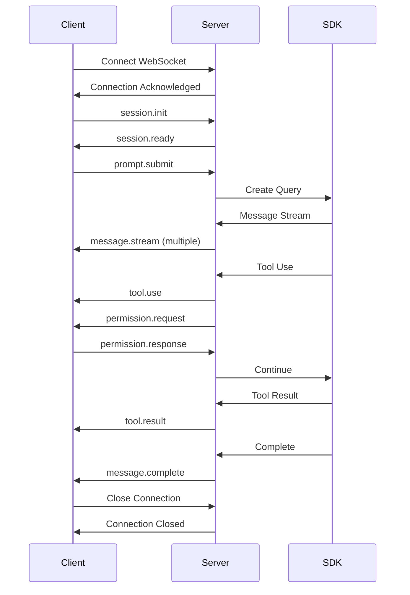

# API Specification

## Overview

This document defines the WebSocket and REST API interfaces for the Claude Code Web implementation, ensuring complete compatibility with CLI features while enabling web-specific functionality.

## WebSocket API

### Connection Establishment

```
ws://localhost:3000/ws
wss://production.example.com/ws
```

#### Connection Headers
```http
Upgrade: websocket
Connection: Upgrade
Authorization: Bearer <jwt_token>
X-Session-ID: <optional_session_id>
X-Client-Version: 1.0.0
```

### Message Format

All WebSocket messages use JSON format with a consistent structure:

```typescript
interface WSMessage {
  id: string;          // Unique message ID
  type: string;        // Message type
  timestamp: number;   // Unix timestamp
  payload: any;        // Type-specific payload
}
```

### Client → Server Messages

#### 1. Initialize Session
```json
{
  "type": "session.init",
  "payload": {
    "sessionId": "optional-existing-session-id",
    "resumeFrom": "optional-message-id",
    "preferences": {
      "model": "sonnet",
      "permissionMode": "default",
      "theme": "dark"
    }
  }
}
```

#### 2. Submit Prompt
```json
{
  "type": "prompt.submit",
  "payload": {
    "content": "Help me write a function",
    "attachments": [
      {
        "type": "file",
        "path": "/path/to/file.ts",
        "content": "optional-base64-content"
      }
    ],
    "options": {
      "model": "opus",
      "stream": true
    }
  }
}
```

#### 3. Execute Command
```json
{
  "type": "command.execute",
  "payload": {
    "command": "help",
    "args": ["commands"],
    "raw": "/help commands"
  }
}
```

#### 4. Interrupt Operation
```json
{
  "type": "operation.interrupt",
  "payload": {
    "targetId": "query-id-to-interrupt",
    "reason": "user_requested"
  }
}
```

#### 5. Change Mode
```json
{
  "type": "mode.change",
  "payload": {
    "mode": "plan",
    "persist": true
  }
}
```

#### 6. Key Press Event
```json
{
  "type": "input.keypress",
  "payload": {
    "key": "Tab",
    "modifiers": ["shift"],
    "currentInput": "partial command",
    "cursorPosition": 15
  }
}
```

#### 7. Request Autocomplete
```json
{
  "type": "autocomplete.request",
  "payload": {
    "input": "/he",
    "cursorPosition": 3,
    "context": "command"
  }
}
```

#### 8. History Navigation
```json
{
  "type": "history.navigate",
  "payload": {
    "direction": "previous",
    "currentInput": "current text"
  }
}
```

#### 9. Tool Permission Response
```json
{
  "type": "permission.response",
  "payload": {
    "toolUseId": "tool-use-123",
    "decision": "allow",
    "remember": true,
    "modifiedInput": {
      "path": "/safe/path/file.txt"
    }
  }
}
```

#### 10. Background Process Control
```json
{
  "type": "process.control",
  "payload": {
    "action": "kill",
    "processId": "process-123"
  }
}
```

### Server → Client Messages

#### 1. Session Established
```json
{
  "type": "session.ready",
  "payload": {
    "sessionId": "uuid",
    "userId": "user-123",
    "model": "sonnet",
    "permissionMode": "default",
    "context": {
      "used": 1500,
      "limit": 200000,
      "percentage": 0.75
    },
    "features": {
      "mcp": true,
      "hooks": true,
      "outputStyles": true
    },
    "messages": [...],
    "todos": [...],
    "backgroundProcesses": [...]
  }
}
```

#### 2. Message Stream
```json
{
  "type": "message.stream",
  "payload": {
    "messageId": "msg-123",
    "role": "assistant",
    "content": "I'll help you",
    "delta": " write",
    "isComplete": false,
    "model": "claude-3-opus-20240229"
  }
}
```

#### 3. Tool Use Notification
```json
{
  "type": "tool.use",
  "payload": {
    "toolUseId": "tool-123",
    "messageId": "msg-123",
    "name": "Edit",
    "status": "executing",
    "input": {
      "file_path": "/src/main.ts",
      "old_string": "const x = 1",
      "new_string": "const x = 2"
    },
    "progress": 0
  }
}
```

#### 4. Tool Result
```json
{
  "type": "tool.result",
  "payload": {
    "toolUseId": "tool-123",
    "status": "completed",
    "output": "File edited successfully",
    "duration": 150,
    "error": null
  }
}
```

#### 5. Context Update
```json
{
  "type": "context.update",
  "payload": {
    "used": 5000,
    "limit": 200000,
    "percentage": 2.5,
    "breakdown": {
      "messages": 4500,
      "tools": 500
    }
  }
}
```

#### 6. Todo Update
```json
{
  "type": "todos.update",
  "payload": {
    "todos": [
      {
        "id": "todo-1",
        "content": "Implement authentication",
        "status": "in_progress",
        "activeForm": "Implementing authentication"
      }
    ],
    "action": "update"
  }
}
```

#### 7. Command Result
```json
{
  "type": "command.result",
  "payload": {
    "command": "help",
    "output": "Available commands:\n/help - Show this help\n...",
    "success": true,
    "ephemeral": true
  }
}
```

#### 8. Autocomplete Suggestions
```json
{
  "type": "autocomplete.suggestions",
  "payload": {
    "requestId": "auto-123",
    "suggestions": [
      {
        "text": "/help",
        "displayText": "help - Show available commands",
        "type": "command",
        "icon": "💡"
      }
    ]
  }
}
```

#### 9. Permission Request
```json
{
  "type": "permission.request",
  "payload": {
    "toolUseId": "tool-123",
    "toolName": "Write",
    "input": {
      "file_path": "/etc/passwd",
      "content": "..."
    },
    "risk": "high",
    "suggestion": "This operation could modify system files"
  }
}
```

#### 10. Error Message
```json
{
  "type": "error",
  "payload": {
    "code": "RATE_LIMIT",
    "message": "Rate limit exceeded",
    "details": {
      "limit": 100,
      "reset": 1234567890
    },
    "recoverable": true
  }
}
```

#### 11. System Notification
```json
{
  "type": "system.notification",
  "payload": {
    "level": "info",
    "message": "Session will expire in 5 minutes",
    "action": {
      "label": "Extend Session",
      "command": "session.extend"
    }
  }
}
```

## REST API

### Authentication

#### Login
```http
POST /api/auth/login
Content-Type: application/json

{
  "email": "user@example.com",
  "password": "secure-password"
}

Response:
{
  "token": "jwt-token",
  "user": {
    "id": "user-123",
    "email": "user@example.com",
    "name": "John Doe"
  },
  "expiresIn": 86400
}
```

#### Refresh Token
```http
POST /api/auth/refresh
Authorization: Bearer <refresh-token>

Response:
{
  "token": "new-jwt-token",
  "expiresIn": 86400
}
```

### Session Management

#### List Sessions
```http
GET /api/sessions
Authorization: Bearer <token>
Query: ?limit=20&offset=0&status=active

Response:
{
  "sessions": [
    {
      "id": "session-123",
      "title": "Implementing authentication",
      "model": "sonnet",
      "messageCount": 42,
      "contextUsage": 15000,
      "createdAt": "2024-01-01T00:00:00Z",
      "lastActiveAt": "2024-01-01T01:00:00Z"
    }
  ],
  "total": 150,
  "hasMore": true
}
```

#### Get Session Details
```http
GET /api/sessions/{sessionId}
Authorization: Bearer <token>

Response:
{
  "id": "session-123",
  "messages": [...],
  "todos": [...],
  "context": {...},
  "metadata": {...}
}
```

#### Delete Session
```http
DELETE /api/sessions/{sessionId}
Authorization: Bearer <token>

Response: 204 No Content
```

#### Export Session
```http
GET /api/sessions/{sessionId}/export
Authorization: Bearer <token>
Query: ?format=markdown

Response (markdown):
# Claude Code Session
...

Response (json):
{
  "session": {...},
  "messages": [...],
  "tools": [...]
}
```

### Settings Management

#### Get User Settings
```http
GET /api/settings
Authorization: Bearer <token>

Response:
{
  "theme": "dark",
  "model": "sonnet",
  "fontSize": 14,
  "keyBindings": "default",
  "mcpServers": {...},
  "hooks": {...},
  "outputStyles": {...}
}
```

#### Update Settings
```http
PATCH /api/settings
Authorization: Bearer <token>
Content-Type: application/json

{
  "theme": "light",
  "fontSize": 16
}

Response:
{
  "updated": true,
  "settings": {...}
}
```

### MCP Server Management

#### List MCP Servers
```http
GET /api/mcp/servers
Authorization: Bearer <token>

Response:
{
  "servers": [
    {
      "name": "filesystem",
      "type": "stdio",
      "status": "connected",
      "config": {...}
    }
  ]
}
```

#### Add MCP Server
```http
POST /api/mcp/servers
Authorization: Bearer <token>
Content-Type: application/json

{
  "name": "custom-server",
  "type": "stdio",
  "command": "custom-mcp-server",
  "args": ["--port", "8080"]
}

Response:
{
  "id": "server-123",
  "status": "connecting"
}
```

### File Operations

#### Upload File
```http
POST /api/files/upload
Authorization: Bearer <token>
Content-Type: multipart/form-data

Response:
{
  "fileId": "file-123",
  "path": "/uploads/file-123.txt",
  "size": 1024,
  "mimeType": "text/plain"
}
```

#### Download File
```http
GET /api/files/{fileId}
Authorization: Bearer <token>

Response: File content with appropriate Content-Type
```

### Analytics

#### Get Usage Statistics
```http
GET /api/analytics/usage
Authorization: Bearer <token>
Query: ?period=week

Response:
{
  "period": "week",
  "tokensUsed": 150000,
  "messagesCount": 500,
  "toolExecutions": 250,
  "models": {
    "opus": 50000,
    "sonnet": 80000,
    "haiku": 20000
  },
  "dailyBreakdown": [...]
}
```

## Error Codes

| Code | Description |
|------|-------------|
| 1000 | Invalid message format |
| 1001 | Unknown message type |
| 1002 | Missing required field |
| 2000 | Authentication required |
| 2001 | Invalid token |
| 2002 | Token expired |
| 2003 | Insufficient permissions |
| 3000 | Session not found |
| 3001 | Session expired |
| 3002 | Session limit exceeded |
| 4000 | Rate limit exceeded |
| 4001 | Quota exceeded |
| 5000 | Internal server error |
| 5001 | SDK error |
| 5002 | Database error |
| 6000 | Tool execution failed |
| 6001 | Tool permission denied |
| 7000 | MCP server error |
| 7001 | MCP connection failed |

## Rate Limiting

### Limits
- Authentication: 5 requests per minute
- API calls: 100 requests per minute
- WebSocket messages: 30 per second
- Tool executions: 20 per minute
- File uploads: 10 per hour

### Headers
```http
X-RateLimit-Limit: 100
X-RateLimit-Remaining: 95
X-RateLimit-Reset: 1234567890
```

## WebSocket Connection Lifecycle



## Security Considerations

### Authentication
- JWT tokens with 24-hour expiration
- Refresh tokens with 7-day expiration
- Secure cookie storage option
- Rate limiting on auth endpoints

### Authorization
- Session-level access control
- Tool permission management
- File system access restrictions
- User quota enforcement

### Data Protection
- TLS/SSL for all connections
- Message encryption at rest
- Sensitive data redaction in logs
- GDPR compliance for data retention

## Versioning

The API uses semantic versioning with the version specified in:
- URL path: `/api/v1/...`
- Header: `X-API-Version: 1.0.0`
- WebSocket subprotocol: `claude-code-v1`

## SDK Client Libraries

### TypeScript/JavaScript
```typescript
import { ClaudeCodeClient } from '@anthropic-ai/claude-code-web-client';

const client = new ClaudeCodeClient({
  url: 'wss://api.example.com',
  token: 'your-token'
});

await client.connect();
const session = await client.createSession();

await session.sendPrompt('Hello, Claude!');

session.on('message', (msg) => {
  console.log(msg.content);
});
```

### Python
```python
from claude_code_web import ClaudeCodeClient

client = ClaudeCodeClient(
    url='wss://api.example.com',
    token='your-token'
)

async with client.connect() as session:
    await session.send_prompt('Hello, Claude!')
    
    async for message in session.messages():
        print(message.content)
```

## Testing

### WebSocket Testing with wscat
```bash
wscat -c ws://localhost:3000/ws \
  -H "Authorization: Bearer <token>"

> {"type":"session.init","payload":{}}
< {"type":"session.ready","payload":{...}}
```

### REST API Testing with curl
```bash
curl -X GET http://localhost:3000/api/sessions \
  -H "Authorization: Bearer <token>"
```

### Load Testing with k6
```javascript
import ws from 'k6/ws';
import { check } from 'k6';

export default function() {
  const res = ws.connect('ws://localhost:3000/ws', {
    headers: { 'Authorization': 'Bearer token' }
  }, function(socket) {
    socket.on('open', () => {
      socket.send(JSON.stringify({
        type: 'session.init',
        payload: {}
      }));
    });
    
    socket.on('message', (data) => {
      const msg = JSON.parse(data);
      check(msg, {
        'session ready': (m) => m.type === 'session.ready'
      });
    });
  });
}
```